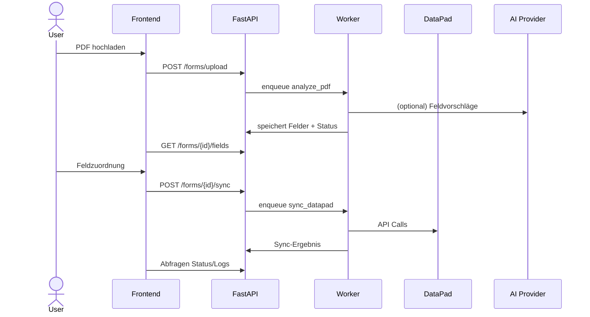

# Architekturübersicht

## High-Level Komponenten
- **Frontend SPA (React + Vite)**
  - Module: Dashboard, FormWorkspace, FieldMapping, Settings
  - State-Layer: Zustand Store + RTK Query Ersatz (Custom API Client)
  - UI: Tailwind + shadcn-inspirierte Komponenten (Cards, Tabs, Tables)
- **Backend API (FastAPI)**
  - Router `forms`: Upload, Analyse, Feldlisten, Statusverwaltung
  - Router `datapad`: Felddefinitionen, Synchronisation, Webhooks
  - Router `ai`: optionale KI-Funktionen (nur aktiv mit API-Key)
  - Service Layer: `services/pdf`, `services/ocr`, `services/ai`, `services/datapad`
  - Storage: PostgreSQL (SQLModel/SQLAlchemy, migrations via Alembic)
  - Background Tasks: Celery + Redis (worker für OCR/AI)
- **Worker Infrastruktur**
  - `worker/` Entry-Point, teilt sich Services mit API
  - Tasks: `analyze_pdf`, `sync_datapad`, `generate_ai_suggestions`
- **Infra**
  - Docker Compose (frontend, backend, worker, redis, postgres, traefik)
  - Env Management über `.env` + `.env.production`

## Datenfluss (Kurz)


## Verzeichnisstruktur (Sollzustand)
```
WEB_ADOBE/
  backend/
    app/
      api/
        routes/
        dependencies.py
      core/
        config.py
        logging.py
      models/
      schemas/
      services/
      worker/
    tests/
  frontend/
    src/
      components/
      features/
      pages/
      lib/
      styles/
  infra/
    deployment/
    diagrams/
```

## Sicherheitsaspekte
- File Upload Validation, Antivirus (ClamAV) optional
- Access Control via OAuth2 (Keycloak/NextAuth)
- Audit Logging für alle Änderungen
- Secrets Management (Vault / Doppler / SOPS)

## Erweiterbarkeit
- Microfrontend-fähig durch modulare Routen
- AI Provider austauschbar (Adapter Pattern)
- DataPad Connector isoliert (für weitere Integrationen wiederverwendbar)